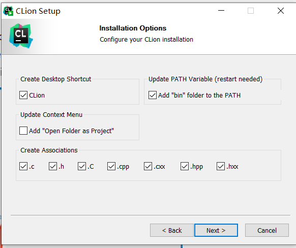

# Lab1

## 实验环境安装

在本课程中，我们要求大家放弃使用`DevCpp`这种不符合时代主流的编辑器，因为`DevCpp`对于C++新标准的支持不够，所以我们要求大家使用如`VSCode`和`CLion`等现代一点的编辑器或IDE。

这里我们将向大家分别介绍`CLion`和`VSCode`的安装方式，大家可以**选其中一种**进行安装和日常使用。在安装`CLion`或`VSCode`之前，我们将先安装一些前置文件。

### Windows环境安装

#### `MinGW`安装

我们首先要进行`MinGW`的安装，我们在elearning中下载文件`x86_64-8.1.0-release-posix-seh-rt_v6-rev0.7z`，并将其解压到某个文件夹中(该文件夹位置非常重要，建议解压到`"C:\Users\用户名"`或`C:\`中)。

之后我们将`MinGW`加入环境变量中。

1. 我们在win10自带的搜索工具中搜索环境变量并打开
   
   

2. 在系统变量中选择`Path`双击，并选择`新建`
   
   

3. 添加环境变量（mingw的bin文件的路径）
   
   我们首先找到`MinGW`中`bin`文件夹的位置，并获取该位置
   
   
   
   然后我们将该路径添加到系统环境变量中
   
   

4. 测试
   
   打开`CMD`或`PowerShell`，输入
   
   ```bash
   g++ -v
   ```
   
   若可以正常显示版本，则证明安装成功。

5. 添加`make`
   
   我们在`MinGW`中`bin`目录下找到`mingw32-make.exe`文件，在同一目录下复制一份该文件，并重命名为`make.exe`，至此，我们可以在Windows下使用`make`命令了。
   

#### `CMake`安装

这一部分内容与上一部分类似，可以直接参考这篇博客[win10下Cmake（make-gui）下载与安装【详细】_小庄同学的博客-CSDN博客_cmakegui下载](https://blog.csdn.net/qq_37112826/article/details/108869737?ops_request_misc=%257B%2522request%255Fid%2522%253A%2522163486929316780271540375%2522%252C%2522scm%2522%253A%252220140713.130102334.pc%255Fall.%2522%257D&request_id=163486929316780271540375&biz_id=0&utm_medium=distribute.pc_search_result.none-task-blog-2~all~first_rank_ecpm_v1~rank_v31_ecpm-2-108869737.pc_search_result_cache&utm_term=window10%20cmake&spm=1018.2226.3001.4187)。

### MacOS环境安装

MacOS中自带了`gcc`，所以不需要像Windows一样安装`MinGW`等编译器。安装`CMake`也相对简单，直接使用`Homebrew`进行安装即可

```bash
brew install cmake
```

如果你没有安装`homebrew`，那么我强烈建议你安装一个，这是一个管理包的非常好用的东西(Windows的同学眼馋的话可以使用`chocolatey`，不过需要动手能力比较强)

### `CLion`安装

#### `CLion`简介

`CLion`是`JetBrains`旗下的一款简单易用的C++IDE，它非常方便进行调试和项目管理。`CLion`主要使用`CMake`进行程序、文件和项目的管理，因此如果使用该IDE，建议对CMake有初步了解（当然，平时一般也用不上多复杂的CMake命令，只需要知道两三个常用语句即可，我们下文会进行介绍）。

#### `CLion`下载及安装

我们可以在[`CLion`官网下载地址](https://www.jetbrains.com/clion/download/#section=windows)进行下载，**注意选择与自己机器匹配的类型**

- [Windows访问该网址](https://www.jetbrains.com/clion/download/download-thanks.html?platform=windows)

- [Intel Mac访问网址](https://www.jetbrains.com/clion/download/download-thanks.html?platform=mac)

- [M1 Mac访问网址](https://www.jetbrains.com/clion/download/download-thanks.html?platform=macM1)

`CLion`是一款收费软件，幸运的是，他为学生和老师提供了专门的免费版，我们可以向[JetBrains教育许可网站](https://www.jetbrains.com/community/education/#students)进行申请获得许可证。在等待审核的期间可以使用试用版本，最多可免费试用30天。

在安装时，我们会进行下载选项的选择，如下进行勾选即可，其他的均可选择默认。



安装成功之后，不习惯英文界面的同学可以在`Plugin`中下载中文插件。


### `VSCode`安装

#### `VSCode`简介

`VSCode`是微软推出的一款轻量、易用（相对而言）、可拓展性强的一款开源编辑器，由于它对各种场景的支持，已经有了编辑器界一统天下的趋势，但在应对一些大型项目时，它的功能也相对局促。如果你日后会用到多种语言，多种场景，那么`VSCode`是你的不二之选。

#### `VSCode`下载与安装

`VSCode`是一款开源软件，可以在[官网](https://code.visualstudio.com/)进行免费下载和使用。注意下载适合自己的版本(依然分Windows, Mac Intel, Mac Apple Silicon)，mac同样可以使用`homebrew`来安装vscode。安装过程中，路径可以自由选择是否要使用默认，其他的均使用默认即可。

在完成安装后，我们可以自行下载一些插件(左侧方块状图标Extensions为插件管理)来方便我们编写代码，如果你不想下载插件，可以直接跳过。这里是一些推荐的插件

> 1. Chinese —— 中文语言支持
> 2. C/C++ —— C/C++语言支持
> 3. C++ Intellisense —— C++语法提示(建议初学者不要使用，否则之后考试时候手写代码可能写不出正确的结果)
> 4. C/C++ Themes —— C/C++主题
> 5. Beatify —— 格式化代码
> 6. Doxygen Documentation Generator —— 文档生成器，帮助你写注释和文档
> 7. CMake —— CMake支持
> 8. CMake Tools —— CMake工具
> 9. Code Runner —— 便捷运行各种代码的工具

#### `VSCode`的C++配置

我们安装完这些插件后依然不能直接运行C++程序，我们需要进行一些配置，具体如下：
使用快捷键`control+shift+P`(Mac为`command+shift+P`)来调出命令面板，并搜索`C/C++:编辑配置(UI)`，便可以进入C++的配置界面。


其中我们关注编译器路径是否正确，如果为空或不正确(一般不为空都是自动检测出来的是正确的)则需要我们手动添加编译器位置，Windows为之前下载的`MinGW`，Mac为`clang`。

在配置界面中，我们还有**编译器参数、C标准、C++标准等**，这些我们可以根据自身的需求进行修改。如使用到C++11特性，则需要在编译参数中添加`-std=c++11`，才可以直接使用运行来运行代码；需要将C++标准设置为`c++11`及以后的标准，否则编辑器会报错（但不代表不能正常编译运行）。

值得注意的是，这些的修改是针对于当前工作区(打开的文件夹)的，如果在其他工作区则只会使用默认配置。

## C++入门

经过第一周的理论学习，我相信大家已经对C++有了基本的了解。现在我们一起用C++写一个HelloWorld。

### HelloWorld

```cpp
#include <iostream>                             // 引入我们需要的头文件

int main() {
    std::cout << "Hello, World!" << std::endl;  // 使用标准流iostream输出Hello World
    return 0;                                   // 返回0表示程序正常退出
}
```

现在我们写好了一个HelloWorld程序，我们要如何让它运行起来呢？以前我们在使用`DevCpp`的时候直接按一个键就运行了，这是怎么做到的呢？这其实是IDE通过在命令行中输入命令来编译并执行的，这里我们将教大家如何手动通过命令行进行编译。

### 命令行编译

我们知道计算机的世界里只有0和1，那么我们写的代码是怎么让计算机知道我们要做什么呢？实际上我们是通过将代码转为机器码，机器码再转为二进制，然后计算机根据二进制数据自己计算的。将代码转为机器码的过程称为编译(Compile)，执行该过程的称为编译器(Compiler)，我们的`MinGW`，`clang`和`gcc`，`g++`均是编译器，我们通过编译器将代码编译为机器码。

如我们现已有一个`main.cpp`程序，那么我们可以在命令行中输入

```bash
g++ main.cpp -o main.exe
上为windows，下为mac
g++ main.cpp -o main
```

即可得到可执行程序`main`。其中`g++`为指明使用的编译器，`main.cpp`为需要编译的程序，`-o`为指定输出文件名，`-o main.exe`即为将编译后的可执行程序命名为`main.exe`，`main.exe`为编译后的可执行程序。

我们的编译过程还可以加上其他的参数来指定编译器编译的方式，比如`-std=c++11`为指明使用C++11标准，这样我们就可以使用C++11的特性了，`-O0`为不使用优化，更多的大家可以自行了解。**我们要求大家掌握的包括`-o`选项、`-std`选项。**

之后我们再在命令行中指明我们要运行的可执行文件，计算机便会读取该可执行文件的机器码并运行，运行后我们可以看到输出结果。

```bash
main.exe
或
./main.exe
(./表示在当前目录下，不加任何东西是默认当前目录，但可能会与我们的其他命令行命令冲突，所以我们一般加上./)
```

### 拓展：`Makefile`和`CMake`的基本用法

现在我们知道我们的每次写一个C++或C语言代码，在运行前都经过了编译和运行两个过程。运行倒还好说，毕竟只需要指明我们要运行的文件名即可，编译每次都一长串内容，我们不希望每次都干相同的活，所以引入了`Makefile`和`CMake`。

`Makefile`的功能很强大，它可以帮助我们自动化处理各种命令行命令，只需要我们提前编写好，那么就可以仅通过一个`make`命令实现我们要求的所有功能。感兴趣的同学可以自行了解，这里扔一个[中文教程](https://seisman.github.io/how-to-write-makefile/index.html)，我们后续如果使用到的话会教大家使用最基本的`make`命令，并不要求大家掌握。

但是由于`Makefile`是平台有关的，不同平台可能有不同的`Makefile`规则，但我们不希望我的写的脚本只能在某一平台运行，我们希望它们是平台无关的。为了解决这个问题，便诞生了工具`CMake`，`CMake`是针对C和C++使用的用于编译和构建的一个工具，它可以自动检测平台，自动生成相应的`Makefile`或直接生成相应的可执行文件。我们的所有lab都会为大家提供cmake文件以帮助大家编译程序、构建和组织项目。为了让大家可以理解我们提供的cmake文件，这里我们结合本次lab的`CMake`文件向大家介绍一些基本的语句，其他的大家可以自行了解。

```cmake
cmake_minimum_required(VERSION 3.17)   # 指明cmake的最低版本
project(my_project)                    # 定义项目名称为my_project
set(var data)                          # 定义变量var为data
# 这个定义的变量可以由我们自己指定，也可以用来指定一些项目的内容，比如指定我们要用的C++标准。
set(CMAKE_CXX_STANDARD 14)             # 指定C++标准为14
# 在我们的几次lab中，我们默认帮大家把C++标准开到C++14，我们鼓励大家使用现代C++风格，使用更安全更高效的代码管理方式。关于具体的现代C++风格，我们会在之后的课程中进行一些介绍。
include_directories(.)                 # 包含当前目录
# 在现代操作系统中，会使用`.`来代指当前目录，`..`代指上级目录，`~/`代指根目录，如果不带任何前缀则为绝对路径。如果你现在不明白我在说什么，不用担心，以后你会自然而然地清楚的。
# 在CMake中，我们可以使用`include_directories`来指定我们要包含的目录，这样我们就可以在项目中使用这些目录中的文件了。
add_executable(endlessLoop
        endlessLoop.cpp)               # 定义一个可执行文件endlessLoop(会自动根据平台生成不带后缀名的可执行文件(Unix系统)或.exe文件(Windows系统))，该可执行文件使用endlessLoop.cpp文件来编译生成。
```

当你看完以上的例子，相信你已经可以理解我们之后所有lab提供的`CMake`文件了。一些进阶用法留给大家自行探索。

现在假设我们在当前目录已经有了cmake文件且当前终端位置为当前目录，我们要如何使用它来编译我们的项目呢？首先我们在我们当前目录下创建一个`build`目录，这个目录用于存储我们生成的各种文件。这是一个好习惯，将我们的代码和生成的中间文件和可执行文件等分开，以方便我们管理。然后在终端中输入命令`cd build`以进入`build`目录，然后我们执行`cmake ..`命令，这样就会自动读取上一目录(也即是含有cmake文件的那个目录)中的cmake文件并执行，执行生成的文件就会存储在`build`目录中。

总而言之，大致流程如下:

```bash
# 假设当前目录名称为project，且路径为path，CMakeLists.txt文件在当前目录中
# 创建文件夹build
~/path/project$ mkdir build
# 进入build目录
~/path/project$ cd build
# 生成CMake文件
~/path/project/build$ cmake ..

# 此时build文件夹下便会有可执行文件或Makefile文件(取决于使用的平台)
# 如果你得到的是可执行文件，那么你就可以直接运行了
# 如果你得到的是Makefile文件，那么还需要你手动运行一次Makefile来生成可执行文件，方法也很简单，直接一句make命令完事
~/path/project/build$ make
# 如果你是Windows系统，你可能会提示make命令无法找到，这就需要在安装MinGW时，设置好环境变量并重命名mingw32-make为make

# 如果你是Windows系统，在执行这一步时可能出现找不到对应文件的错误
# 这可能是因为你的路径名带中文，而Windows系统的默认中文编码方式为gbk，而make命令默认使用的编码方式为utf-8
# 解决方法有两种，一种就是将文件存在不带中文路径的目录下，重新cmake一遍
# 另一种是将系统编码方式改为utf-8(该过程可以参考[这里](https://blog.csdn.net/xt_v2012/article/details/93784751))，这样make命令就可以正常执行了
```

### `argc`和`argv`是什么

我相信经过大一C语言的学习，大家肯定已经在GitHub、CSDN、博客园、StackOverflow、知乎等网站上看过一堆别人写的代码。有的时候，我们会发现别人写的代码中`main`函数跟我们写的好像不太一样，他们的`main`函数好像带参数，并且长下面这样。

```c
int main(int argc, char *argv[]) {
   // some code...
   return 0;
}
```

这是什么意思呢？我们知道我们的函数都是可以指定参数的，我们的`main`函数也不例外，但是`main`函数的参数又由谁来传呢？这就得回到我们之前说的命令行执行可执行文件的情况了。在命令行里执行可执行文件时，我们希望我们可以手动指定参数来规定我们的程序的运行方式。于是我们可以在可执行文件文件名后面加上一些用空格分开的字符串以作为参数传入主程序中，如下所示：

```bash
./my_program 114514 gayhub
```

那么，我们的`main`函数就会接收到这些参数，这些参数就是`argc`和`argv`。其中，`argc`为参数总个数，`argv`为参数数组。以上面这个例子为例，我们可以得到`agrc==3`，`argv[0]==./my_program`，`argv[1]==114514`，`argv[2]==gayhub`。

至此，你就学会了在命令行中为可执行文件传递参数了。

### 重点：Debugger的使用

我相信大家平时在写代码时难免遇到bug，我们希望解决这些bug，一般我们就会使用调试(debug)的方式来找出并解决这些问题，这时候我们就会用到调试器(debugger)来帮助我们更方便的调试。

调试的过程也非常简单，概括来说就是设置断点(breakpoint)和运行。调试状态下程序会在运行到断点位置时停下，我们便可以通过调试器来查看程序的运行状态以及一些关键参数的值，我们便可以通过观察实际值与逻辑值的差异来找到我们代码的问题所在。

我们会在课上和录屏中分别用不同平台、不同编辑器来演示调试的流程。大家也可以参考[这里(VSCode)](https://zhuanlan.zhihu.com/p/110027894?from_voters_page=true)和[这里(CLion)](https://blog.csdn.net/qq_37611824/article/details/90696686)或者[CLion官方文档](https://blog.jetbrains.com/zh-hans/2019/05/14/clion/)来查看调试的流程。

## 作业

### 作业内容

1. 自行编写一个Hello程序，要求为
   
   - 用到`agrc`和`argv`，使用的方式见下面第三点
   
   - 使用命令行手动编译生成可执行文件或自己写CMakeLists.txt文件生成可执行文件，并将可执行文件命名为`hello`
   
   - 使用`argc`和`argv`的方式在命令行中传递参数，并且在程序中使用`cout`函数输出参数。实现如下输入输出方式：
     
     ```bash
     $ ./hello OOP
     Hello OOP
     $ ./hello
     Hello World
     $ ./hello C++
     Hello C++
     $ ./hello World
     Hello World
     ```

2. 利用`CMake`工具生成可执行文件`endlessLoop`和`segmentFault`，`CMakeLists.txt`文件已提供。

3. 利用调试器寻找上述两个程序的bug，**不要求大家解决bug**。

### 提交须知

- 时间
  - 给大家的时间为两周，也即下次上机课前完成即可。也即**3月17日**前完成，初步定为**3月17日22:00**。
- 提交内容
  - 一份报告，报告包括`hello`程序代码截图、命令行编译`hello`程序过程截图、`hello`程序运行结果截图，如有必要可添加关键步骤的思路等；`endlessLoop`和`segmentFault`用`CMake`生成的步骤过程截图，两个程序中出错位置的截图(可选)，阐述出错原因，只要讲出关键因素即可，不需要长篇大论。防止大家卷报告，要求大家的**字数不能超过500**，否则适当扣分。
- 提交须知
  - 请认真阅读实验须知，如有疑问请联系助教[@黄绵秋](19307130142@fudan.edu.cn)或[@王少文](19307130251@fudan.edu.cn)。
  - 如果大家超时提交，每超时1天分数减少20%(不足1天按1天计)，最低分数为0分。
- 评分标准
  - 本次提交内容为报告一篇，故没有评分脚本。
  - 赋分项
    - `hello`程序代码无bug——5分
    - `hello`程序编译过程无误——20分
    - `hello`程序运行结果无误——10分
    - `endlessLoop`和`segmentFault`用`CMake`生成的步骤无误——20分
    - 正确找到和阐述`endlessLoop`和`segmentFault`中的错误和出错原因——40分
    - 代码风格——5分
  - 扣分项
    - 若报告可读性极差，会适当扣分，扣分上限为10分
    - 卷报告字数的行为被反对，字数超过500会适当扣分，扣分上限为10分
  - 加分项
    - 使用`CMake`或`Makefile`来编译生成`hello`可执行文件——5分
    - 使用C++风格代码解决`endlessLoop`和`segmentFault`中的错误使其能正确运行——15分
  - 关于*赋分项、扣分项、加分项*的解读请参考实验须知(以后不会再对此进行阐述)。
- 提交平台
  - 正常提交：`elearning`作业板块
  - 迟交导致无法在`elearning`上提交：联系助教进行提交
  - 特殊原因无法提交：联系助教进行提交